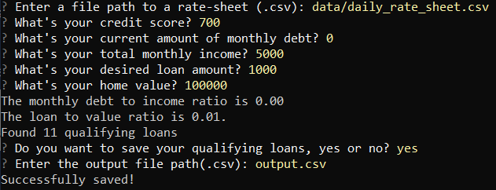
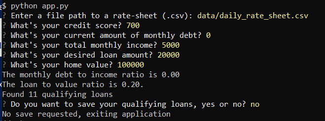
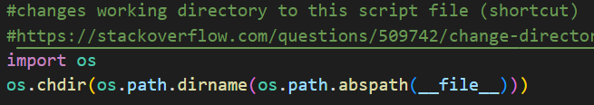

# Loan Qualifier Application

This is a CLI (command line interface) application that mimics the behavior of a loan qualifier program, where a user can input their personal information (credit score, monthly debt, monthly income, desired loan amount, home value) and the application then matches them with loans that they qualify for. The user can then choose to save a list of the loans that are matched with them. 

This is a challenge assignment from Rice's FinTech Bootcamp program due on June 23, 2022. The purpose of this assignment is to demonstrate knowledge working with README files, along with the questionary and fire libraries (to demonstrate working with CLIs), in addition to incorporating our python knowledge up to this point.

---

## Technologies

This program is written in Python (3.7.13) and developed using VS Code using Windows. Libraries incorporated are pathlib, csv (1.0), os, fire (0.4.0), and questionary (1.10.0) (see parenthesis for versions used in program development).  

Here are some helpful links for further information on fire and questionary: 

[Fire library](https://github.com/google/python-fire)

[Questionary library](https://pypi.org/project/questionary/)


---

## Installation Guide

Downloading the code & associated files using `git clone` from the repository is sufficient to download the program, ensure that the associated libaries (see Technologies section) are installed on your machine as well. If there are any issues with the library functions please refer to the versions used for app development (see Technnologies section for this information as well).  Running the `app.py` file will get the application started, please note that this is a CLI (commandline application).  

---

## Usage

This program is designed to run from the command line (but will also run using VS Code or other environments), keep in mind that you need to be able to interact with a terminal in order to respond to the user prompts. The usage case below is an example of how to run this application using git bash. 

First, ensure that the appropriate libraries are installed. Please refer to the Technologies section for the full list of referenced libraries. 

```python
pip install fire
pip install questionary
```

After cloning the repository on your computer, `cd` into the loan_qualifier_app folder and type `python app.py` to run the program. 

Here is an example of a successful interaction with the program that demonstrates using the application and saving the output: 



If you choose not to save the file, the prompts will appear as below: 




## A note on paths:

Please keep in mind that the working directory is set to that of the `app.py` file when the program begins, so the input path for the rate sheet file should  be `data/daily_rate_sheet.csv` unless you save it in another location or choose to refer to another file saved elsewhere. Similarly simply specifying `output.csv` in the prompt for the output file path will just save your output in the repository folder. 

If you want to remove the capability of the program to reset the current working directory to app.py's source folder please remove the following line of code from the beginning of the `app.py` file: 



---

## Contributors

Project contributors are myself (Paula K) and the Rice FinTech Bootcamp program team (with instructor Eric Cadena). 

---

## License

None
